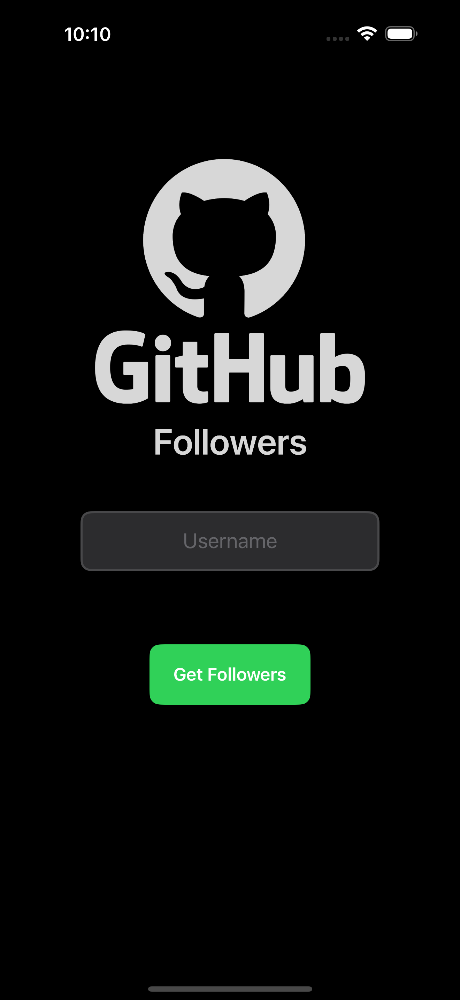
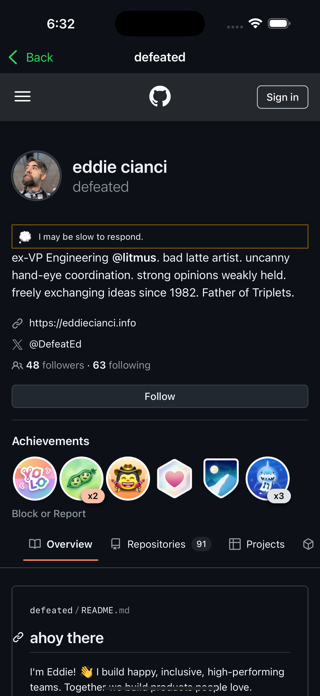

# GitHub Followers App
An iOS app to search for GitHub users, view their followers and see their GitHub profiles.

## Screenshots
- Light Mode

  
  
  
  
  
  
  

- Dark Mode

  
  
  
  
  
  
  

## Features
- Search for GitHub users by username.
- View a list of a user's followers.
- Search within the followers list.
- Pagination support — loads 30 followers per page and more when you scroll to the bottom.
- Tap on a follower to view their GitHub profile in an in-app web view.
- Handles invalid usernames with a custom alert.
- Displays an empty state custom view when a user has no followers.
- Supports both light and dark modes.
- Image caching for followers' avatars.
No login is needed – just search and explore!

## Built with:
- MVVM + Clean Architecture.
- Protocol-Oriented Programming (POP).
- UIKit + SnapKit (UI).
- RxSwift (reactive).
- WKWebView.
- URLSession (networking).
  
## Dependencies
- [SnapKit](https://github.com/SnapKit/SnapKit) - Auto Layout
- [RxSwift](https://github.com/ReactiveX/RxSwift) - Reactive programming

